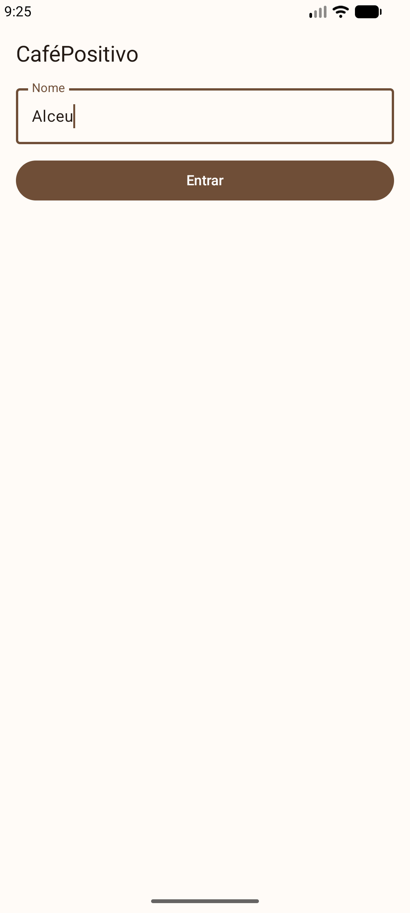
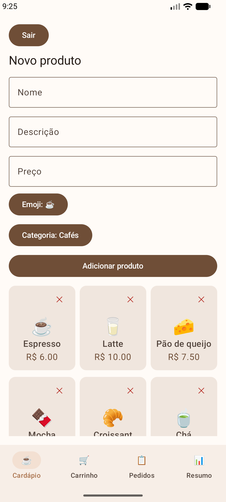
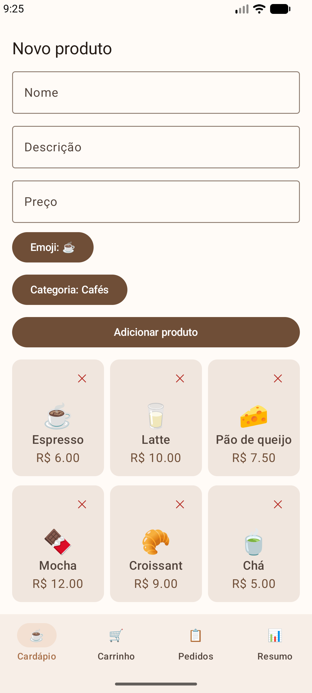
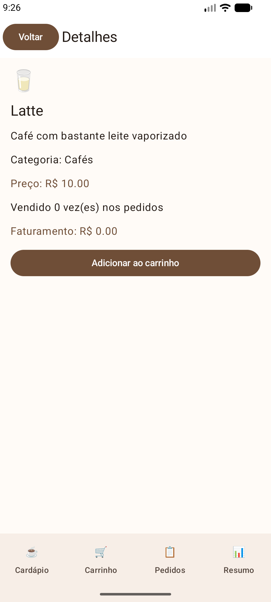
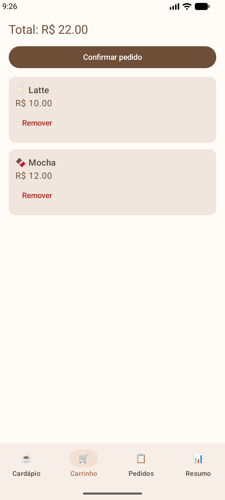
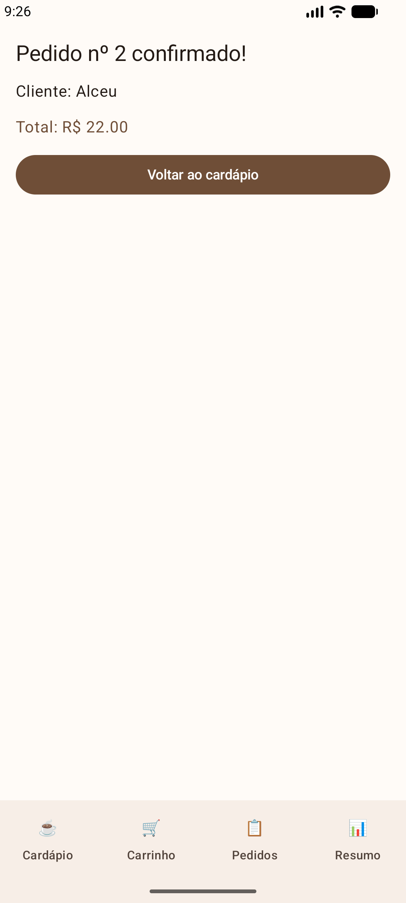
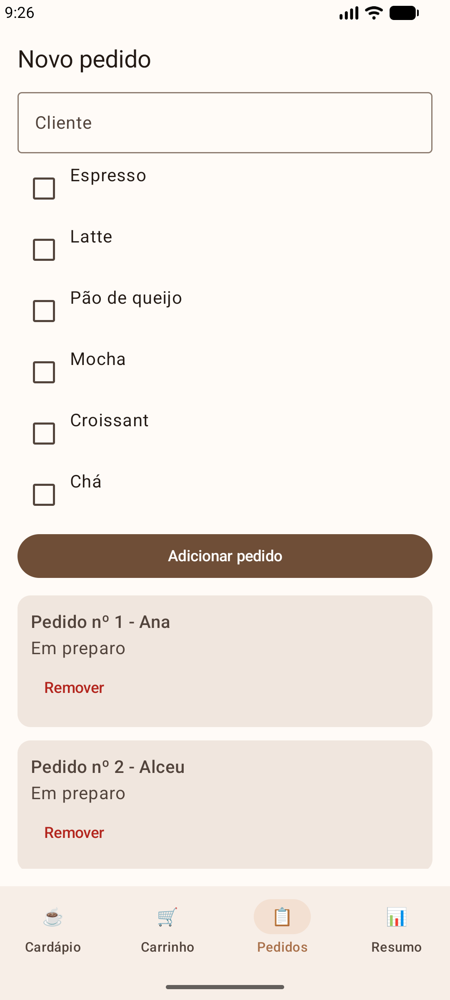
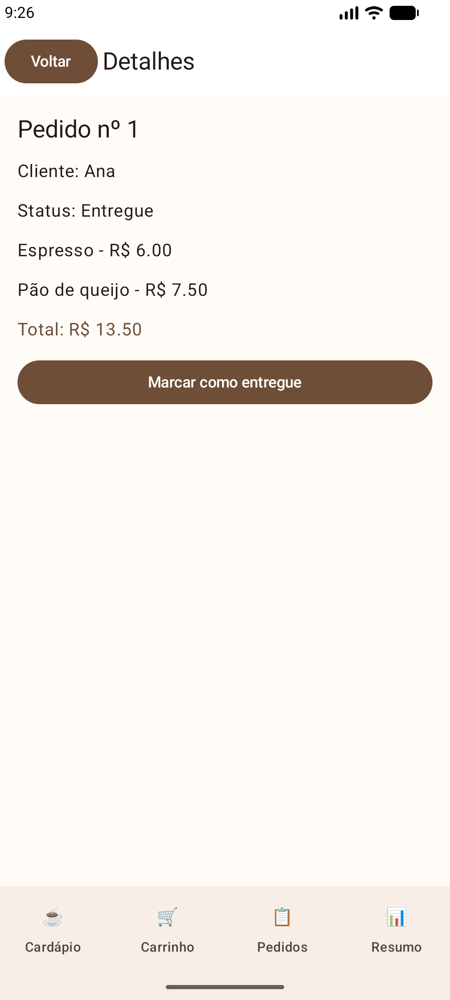
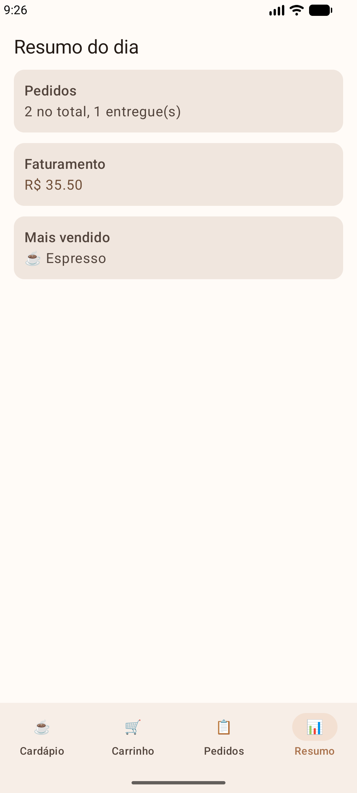

# CaféPositivo

Trabalho 2 (MAF - Mínimo Aplicativo Funcional) da disciplina de Android. É um app de pedidos de
uma cafeteria, feito em Kotlin com Jetpack Compose e Material 3.

O app agora tem navegação de verdade entre as telas, duas listas em que dá para adicionar e
remover itens, e telas de detalhes que mostram o item que foi clicado. Os dados ficam só na
memória: se o app for fechado, eles voltam ao que estava no começo.

## Como rodar

1. Abrir a pasta `MyApplication4` no Android Studio
2. Esperar o Gradle sincronizar
3. Rodar no emulador ou em um celular

## Telas (8)

| # | Tela | O que faz |
|---|---|---|
| 1 | Login | Campo de nome; o botão só libera com 3 letras ou mais |
| 2 | Cardápio (lista de Produtos) | Adicionar produto pelo formulário, remover pela lixeira, clicar abre o detalhe |
| 3 | Carrinho | Itens escolhidos, remover item, total e confirmar pedido |
| 4 | Categorias (lista de Categorias) | Adicionar categoria, remover (só se estiver vazia), clicar abre o detalhe |
| 5 | Detalhe do produto | Personaliza o pedido e calcula o preço final (veja abaixo) |
| 6 | Detalhe da categoria | Mostra os produtos da categoria, preço médio, mais barato e mais caro |
| 7 | Perfil | Resumo do usuário e botão de sair |
| 8 | Confirmação | Número do pedido, cliente e total |

A barra de baixo (BottomNavigation) leva para Cardápio, Categorias, Carrinho e Perfil.
As telas de detalhe têm a barra de cima com o botão de voltar.

## O que a tela de Detalhes faz a mais

O **Detalhe do produto** não só repete os campos do item. Ele:

- calcula o **preço final** conforme o tamanho e o tipo de leite escolhidos;
- mostra a **categoria** do produto (dado que vem da outra lista);
- tem um botão **Ver categoria** que abre o Detalhe da categoria (navegação secundária).

O **Detalhe da categoria** combina as duas listas: mostra os produtos que pertencem a ela e
calcula quantidade, preço médio, mais barato e mais caro.

## Como o código está organizado

| Arquivo | O que é |
|---|---|
| `MainActivity.kt` | Só liga o tema ao `AppNavigation` |
| `AppNavigation.kt` | Objeto `Rotas`, `NavHost`, `TopAppBar` e `NavigationBar` |
| `AppState.kt` | Todos os dados em memória (`mutableStateListOf`) e as funções de adicionar/remover |
| `Modelos.kt` | As data classes `Categoria`, `Produto` e `ItemPedido` |
| `Componentes.kt` | Componentes reaproveitados (dropdown e linha de informação) |
| `Tela*.kt` | Uma tela por arquivo |
| `ui/theme/` | Cores (paleta marrom) e tema |

## Como a navegação funciona

As rotas ficam no objeto `Rotas`, como `const val`. As telas de detalhe recebem o `id` do item
na rota (`produto/{id}`, `categoria/{id}`) e usam esse id para buscar o item certo no `AppState`.

```kotlin
navController.navigate(Rotas.produto(produto.id))
```

O botão de voltar da barra de cima chama `navController.popBackStack()`.

## Documentação do processo

Veja o arquivo [PROCESSO.md](PROCESSO.md).

## Limitações

- Os dados só existem enquanto o app está aberto (sem banco de dados)

## Tecnologias

Kotlin, Jetpack Compose, Material 3 e Navigation Compose.

## Imagens

<table>
  <tr>
    <td align="center" width="33%">
      <b>1. Login</b><br>
      <br>
      <sub>Botão só libera com 3 letras ou mais</sub>
    </td>
    <td align="center" width="33%">
      <b>2a. Cardápio — Formulário</b><br>
      <br>
      <sub>Adicionar produto pelo formulário</sub>
    </td>
    <td align="center" width="33%">
      <b>2b. Cardápio — Grade</b><br>
      <br>
      <sub>Lista de produtos com remoção pela lixeira</sub>
    </td>
  </tr>
  <tr>
    <td align="center">
      <b>3. Detalhe do produto</b><br>
      <br>
      <sub>Tamanho, leite e preço final calculado</sub>
    </td>
    <td align="center">
      <b>4. Carrinho</b><br>
      <br>
      <sub>Itens escolhidos, total e confirmar pedido</sub>
    </td>
    <td align="center">
      <b>5. Confirmação</b><br>
      <br>
      <sub>Número do pedido, cliente e total</sub>
    </td>
  </tr>
  <tr>
    <td align="center">
      <b>6. Pedidos</b><br>
      <br>
      <sub>Pedidos já realizados</sub>
    </td>
    <td align="center">
      <b>7. Detalhe do pedido</b><br>
      <br>
      <sub>Itens e valores de um pedido</sub>
    </td>
    <td align="center">
      <b>8. Resumo</b><br>
      <br>
      <sub>Resumo do usuário</sub>
    </td>
  </tr>
</table>
 

 

 
 
 
 
